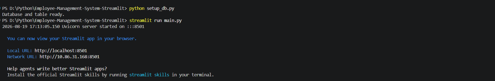
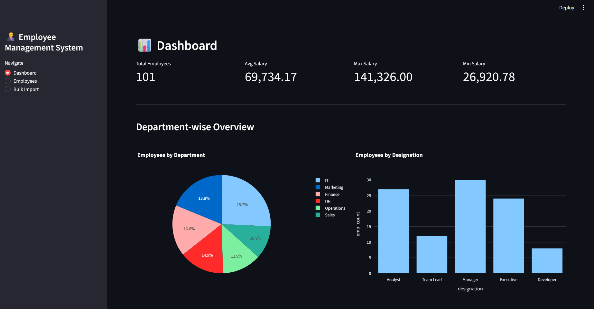
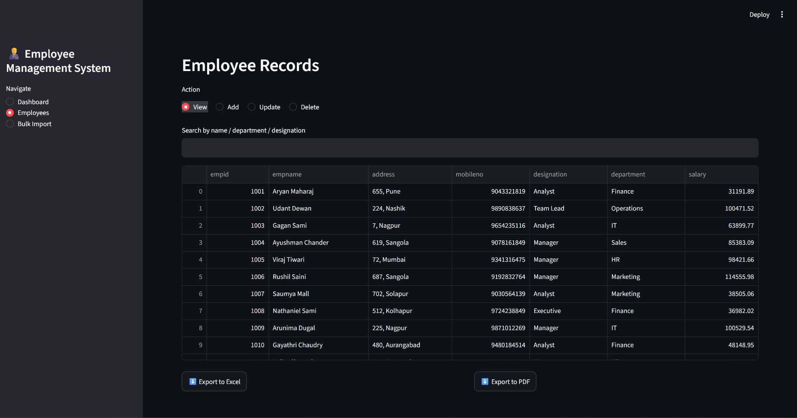
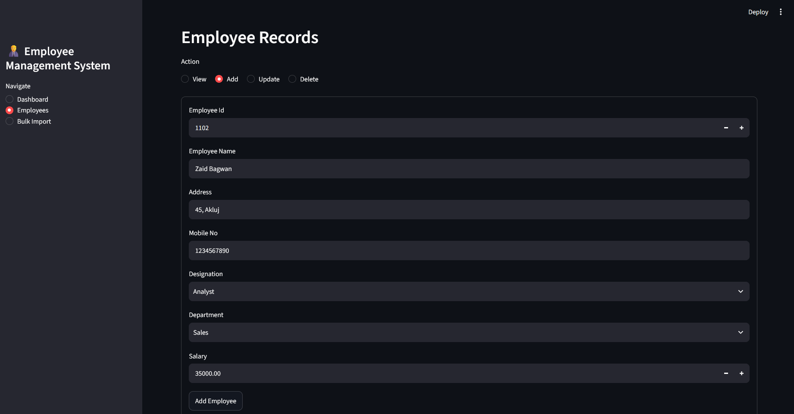
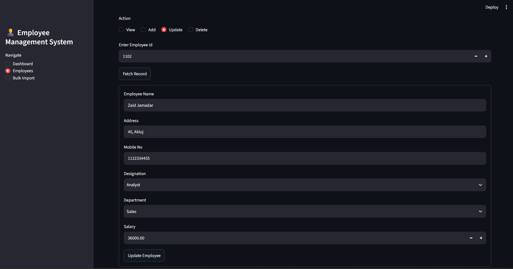
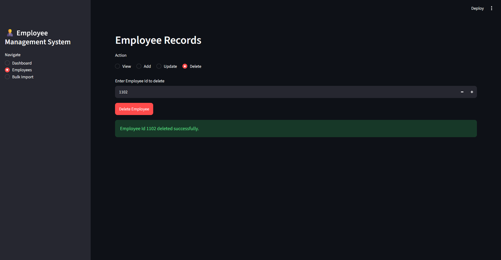
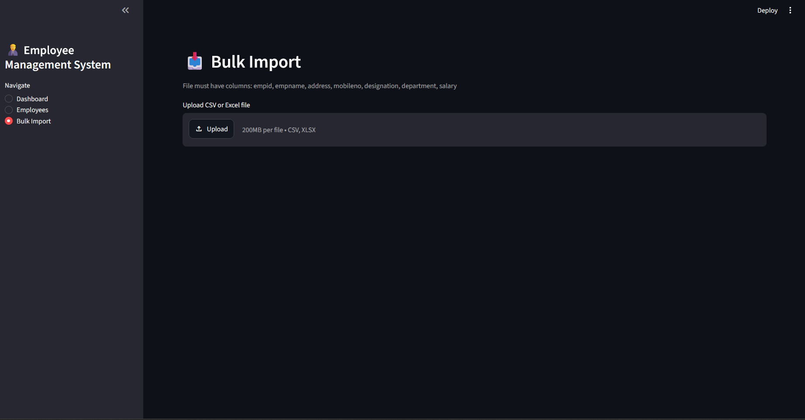

# 📝 Employee Management System 

**Employee Management System** is a **modern web-based employee management system** built with **Python, Streamlit, and MySQL**, designed to simplify HR record-keeping with a clean and interactive dashboard-driven interface.

The system supports **full employee record management**, allowing users to add, view, update, delete, and search employee data, while visual dashboards give instant insight into department-wise headcount and salary distribution, with one-click PDF/Excel export for reporting.

This project demonstrates **Python GUI development, database integration, modular architecture, and real-world data visualization workflows**, making it ideal for academic mini-projects and portfolio showcases.

---

## ✨ Key Principles

1. **Separation of Concerns** – Clean `core`, `exporters`, and `gui` separation
2. **Data-Driven Dashboards** – Instant department and salary insights
3. **Structured Architecture** – Modular, reusable functions for every operation
4. **Report Ready** – One-click PDF/Excel export for any view

This system is both **practical and educational**, demonstrating how modern data management dashboards are built using Python and Streamlit.

---

## 🧩 System Overview

The application is built around three core modules:

### 👤 Employee Records

- Add new employee
- View / search all employees
- Update existing records
- Delete records
- Bulk import via CSV/Excel

### 📊 Dashboard

- Total employees, avg/min/max salary metrics
- Department-wise employee distribution
- Designation-wise employee distribution
- Salary-wise department comparison
- Top 5 earners

### 📤 Reports

- Export any filtered view to Excel
- Export any filtered view to PDF
- Export full dashboard report

---

## 🔗 Core Workflow

- User adds/updates employee records through the form
- Data is validated before being saved to MySQL
- Dashboard queries aggregate data live from the database
- Charts render department and salary insights instantly
- Any table view can be exported to PDF or Excel

> Ensures smooth day-to-day HR record management with instant reporting.

---

## ⚙️ Features

- Python web-based application (Streamlit)
- Add / View / Update / Delete employee records
- Search by name, department, or designation
- Input validation (mobile number, name, salary)
- Bulk import employees from CSV/Excel
- Department-wise dashboard (pie & bar charts)
- Salary-wise dashboard (total, average, top earners)
- PDF export using ReportLab
- Excel export using pandas + openpyxl
- Modular folder architecture
- Database-backed persistent storage

---

## 📁 Project Structure

```bash
Employee-Management-System-Streamlit/
│
├── assets/                        # Static assets (logo, images)
├── core/
│   ├── __init__.py
│   ├── config.py                  # DB credentials & constants
│   ├── database.py                # MySQL connection helpers
│   ├── crud.py                    # Add / view / update / delete / search
│   ├── analytics.py               # Dashboard aggregate queries
│   └── validators.py              # Input validation
│
├── exporters/
│   ├── __init__.py
│   ├── excel_exporter.py          # Export to .xlsx
│   └── pdf_exporter.py            # Export to .pdf
│
├── gui/
│   ├── __init__.py
│   ├── dashboard_page.py          # Department + salary dashboards
│   ├── employees_page.py          # CRUD screen
│   └── import_page.py             # Bulk CSV/Excel import
│
├── main.py                        # Entry Point
├── setup_db.py                    # One-time DB setup
├── requirements.txt               # Dependencies
├── LICENSE
└── README.md
```

---

## 🚀 Getting Started

### 1️⃣ Prerequisites
- Python 3.10+
- Streamlit
- MySQL Database
- pip package manager

### 2️⃣ Clone Repository
```bash
git clone https://github.com/ShakalBhau0001/Employee-Management-System-Streamlit.git
cd Employee-Management-System-Streamlit
```

### 3️⃣ Install Dependencies
```bash
pip install -r requirements.txt
```

### 4️⃣ Setup Database
```bash
python setup_db.py
```

### 5️⃣ Run Application
```bash
streamlit run main.py
```

---

## 🔑 Modules

### Employees Page

- Add new employee with validation
- View / search all records
- Update existing employee
- Delete employee
- Export current view to PDF/Excel

### Dashboard Page

- Key metrics: total employees, avg/min/max salary
- Department-wise pie chart
- Designation-wise bar chart
- Salary-wise department comparison
- Top 5 earners table

### Bulk Import Page

- Upload CSV/Excel file
- Column validation before import
- Skips duplicate employee IDs

---

## 🧠 Dashboard Logic

|     Feature       |           Description                 |
|-------------------|---------------------------------------|
| Department Split  | Pie chart of employees by department  |
| Designation Split | Bar chart of employees by designation |
| Salary Comparison | Total & average salary per department |
| Top Earners       | Top 5 highest paid employees          |
| Export            | PDF/Excel of any table shown          |

> All charts and stats are computed live from MySQL, no manual refresh needed.

---

## 🗄️ Database Design

### EMP Table

```json
{
  "empid": 101,
  "empname": "Rahul",
  "address": "Pune",
  "mobileno": 9876543210,
  "designation": "Developer",
  "department": "IT",
  "salary": 45000.00
}
```

---

## 🖼️ Screenshots

### 1. One Time DB Setup



### 2. Dashboard



### 3. Employee View



### 4. Employee Add



### 5. Employee Update



### 6. Employee Delete



### 7.  Data Import



---

## 🛣️ Future Improvements

- Admin login/authentication
- Employee photo upload
- Attendance/leave tracking module
- Email payslip generator
- Multi-user role access

---

## 🙏 Acknowledgments

- Python community
- Streamlit
- MySQL
- Open-source contributors

---

## 📜 License

This project is licensed under the MIT License. See the [LICENSE](LICENSE) file for details.

---

## 👨‍💻 Contributors

> **Developer: Shakal Bhau & Rajlaxmi Patil**
 
> **GitHub: [ShakalBhau0001](https://github.com/ShakalBhau0001) & [Rajlaxmi-1307](https://github.com/Rajlaxmi-1307)**

---

## ⭐ Support

If you like this project, consider giving it a ⭐ on GitHub!

---
